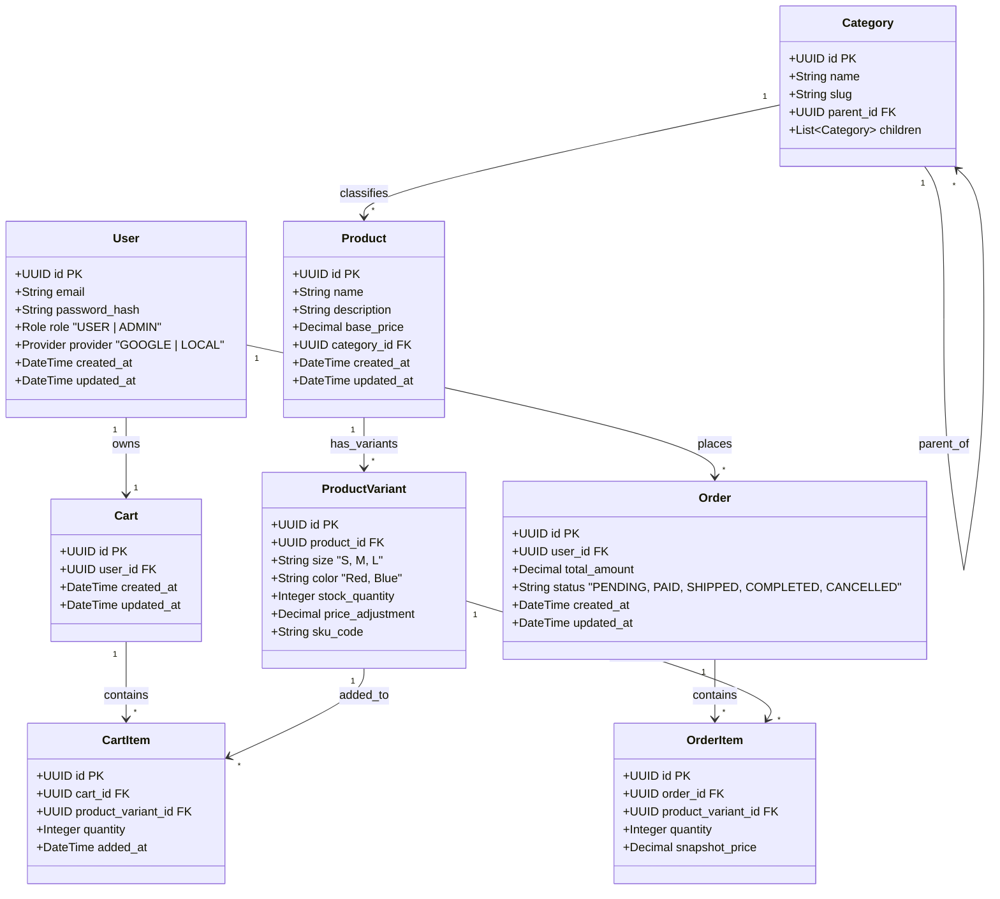

# Database Schema (ERD)

This document outlines the entity relationships for the Fashion E-commerce system.

## Entities Overview

*   **Users**: Stores user authentication and profile info. Supports OAuth (Google) and Local login.
*   **Products**: Base product information.
*   **Product Variants**: Specific SKU variations (Size/Color) with stock and price adjustments.
*   **Categories**: Hierarchical category tree.
*   **Orders**: Transactional records.
*   **Order Items**: Snapshot of items in an order (price fixed at purchase time).
*   **Cart**: Persistent shopping cart for users.

## Diagram (Mermaid Class Diagram)

