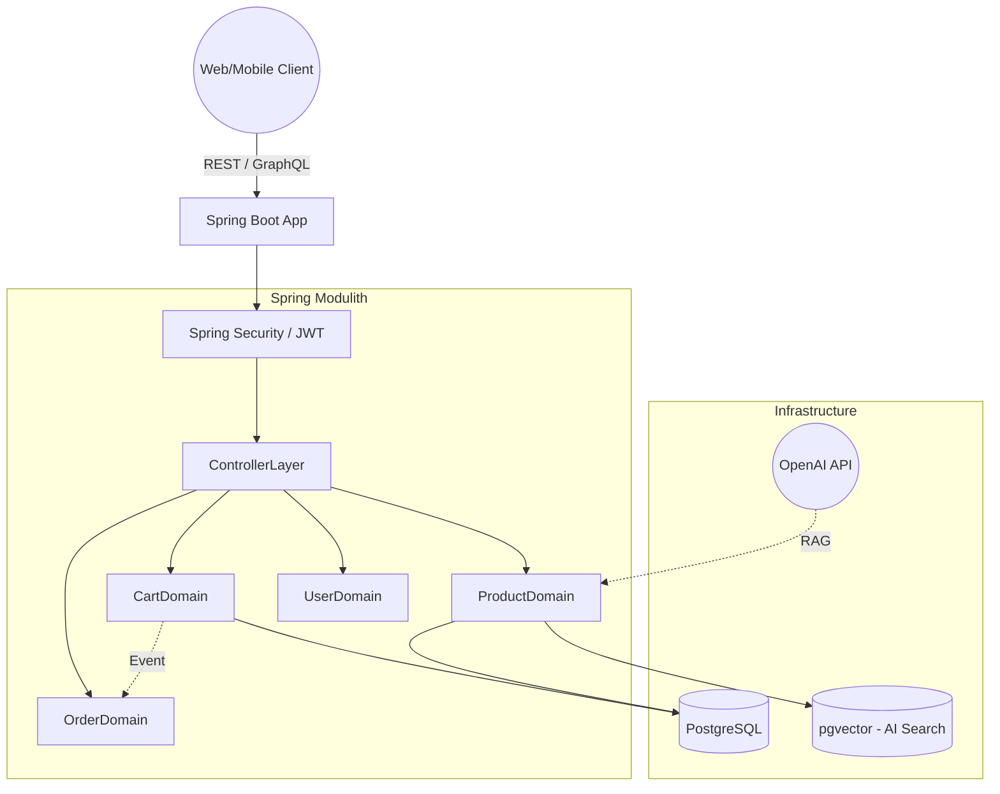

# Kiến Trúc Tổng Quan (System Architecture)

**Tác giả (Owner):** DSkaly | **Ngày cập nhật:** 2026-02-20
**Reviewer:** Technical Lead | **Trạng thái:** Active | **Version:** v1.0

## 1. Mục Đích (Purpose)

Tài liệu này cung cấp cái nhìn tổng quan (bird's-eye view) về kiến trúc hệ thống của Fashion E-Commerce, giải thích các thành phần lõi và cách chúng tương tác với nhau.

## 2. Phạm Vi Khảo Sát (Scope)

- **Bao gồm:** Cấu trúc Monorepo, Spring Modulith Backend, Next.js Frontend, Database (PostgreSQL + pgvector), Redis, tích hợp AI.
- **Không bao gồm:** Luồng nghiệp vụ chi tiết của từng Domain (xem tại folder `/domains`).

## 3. Kiến Trúc Chi Tiết

Hệ thống tuân theo mô hình **Modular Monolith** kết hợp **Event-Driven Architecture**:

## 4. Các Ràng Buộc & Giới Hạn (Constraints & Limitations)

- Khác với Microservices, các module chạy chung trên 1 JVM giúp tối giản DevOps và giảm Network Latency. Đổi lại, nếu có 1 module bị Memory Leak, toàn bộ hệ thống sẽ bị crash.
- Mọi module phải giao tiếp chéo bằng `ApplicationEventPublisher` thay vì `@Autowired` chéo Repository.

## 5. Changelog

- **v1.0:** Khởi tạo tài liệu kiến trúc tổng quan.
