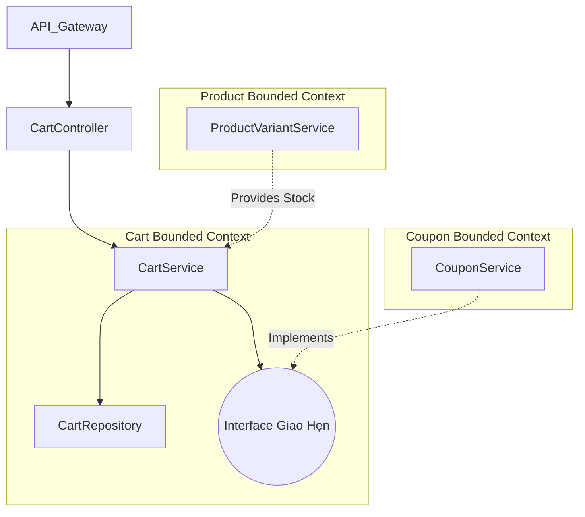

# Domain Đặc Tả: Giỏ Hàng (Cart Bounded Context)

**Tác giả (Owner):** DSkaly | **Ngày cập nhật:** 2026-02-20
**Reviewer:** Domain Expert | **Trạng thái:** Active | **Version:** v1.1

## 1. Mục Đích (Purpose)

Domain `Cart` chịu trách nhiệm quản lý vòng đời giỏ hàng của người dùng (Customer) và khách (Guest). Đây là trung tâm tương tác mua sắm, cần đảm bảo hiệu năng cao và độ chính xác tuyệt đối về giá trị/tồn kho.

## 2. Phạm Vi Khảo Sát (Scope)

- **Bao gồm:** Quản lý Cart Session, tính toán SubTotal/FinalTotal, áp dụng Coupon, Validation Inventory Real-time, lưu trữ Price Snapshot, Logic Merge Guest Cart.
- **Không bao gồm:** Thanh toán (Payment Domain), Xử lý Đơn Hàng (Order Domain), Cập nhật tồn kho vật lý (Inventory Domain).

## 3. Kiến Trúc Chi Tiết / Logic Nghiệp Vụ (Business Logic)

### 3.1 Luồng hoạt động (Data flow)

1. **Add Item:** Hệ thống kiểm tra `stockQuantity` ở `ProductVariant`. Nếu đủ -> Snapshot `basePrice` + `priceAdjustment` vào `CartItem`. (Giá được khóa lại tại thời điểm thêm giỏ).
2. **Apply Coupon:** Domain `Cart` gọi Domain `Coupon` (thông qua Spring Bean hoặc Event) để xác thực (validateCoupon). Tính toán và cập nhật `discountAmount`.
3. **Merge Giỏ Hàng (Login):** Khi user login:
   - Các item từ Guest Cart (`guest_id`) được di chuyển sang User Cart (`user_id`).
   - Nếu User Cart đã có item cùng SKU, cộng dồn `quantity` (capped by max stock).
   - Xóa Guest Cart cũ và bắn súng `CartMergedEvent` cho hệ thống Recommendation/Analytics.
4. **Clean-up:** Lịch trình (Cronjob `@Scheduled`) lúc 3 AM hàng ngày xóa các Guest Carts bị bỏ rơi quá 7 ngày (TTL Strategy).

### 3.2 Sơ đồ giao tiếp Spring Modulith

## 4. Các Ràng Buộc & Giới Hạn (Constraints & Trade-offs)

- **Concurrency:** Hàm gộp giỏ hàng `mergeCart` chạy trên Isolation Level mặc định (READ COMMITTED) để cân bằng TPS thay vì bảo vệ tuyệt đối snapshot. Rủi ro Lost Update thấp do mỗi request đã có khóa ngoại cấp dòng mặc định của JPA. Đã được benchmark giới hạn chịu tải.
- **Dependency Inversion:** Domain `Cart` _không được phép_ import bất kỳ Entity nào của `Coupon` hay `Order`. Bắt buộc phải thông qua DTO hoặc interface port để giữ vách ngăn kiến trúc Modulith.

## 5. Changelog

- **v1.0:** Thiết kế cơ sở dữ liệu `Cart` và `CartItem`.
- **v1.1:** Tích hợp logic Coupon và cơ chế Price Snapshot nhằm chặn bug đổi giá vô lý (2026-02-20).
